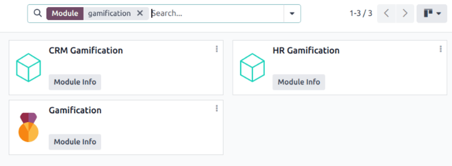
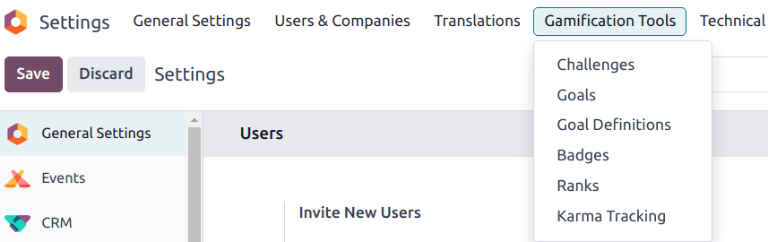
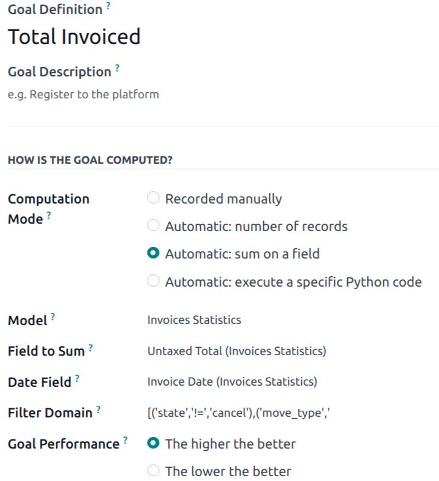
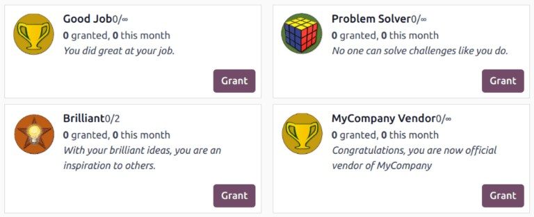
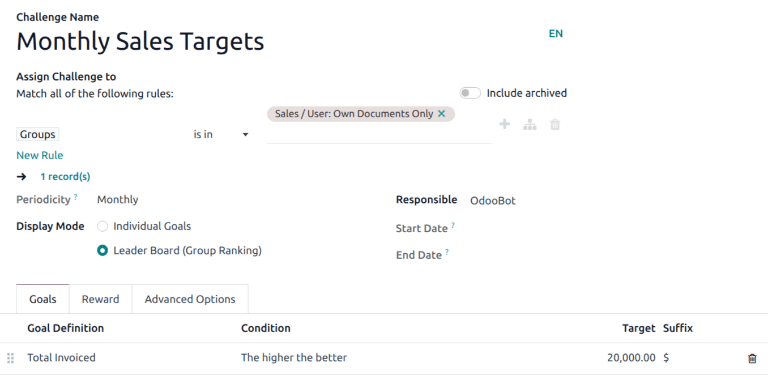

================
CRM Gamification
================

The *Gamification tools* provide the opportunity to evaluate and motivate users through customizable
challenges, goals, and rewards.

Configuration
=============

To install the *Gamification* module, navigate to the :menuselection:`Apps` application. Click into
the :guilabel:`Search...` bar at the top of the page and remove the :guilabel:`Apps` filter. Type
`Gamification` to search.

If the :guilabel:`Gamification` module is **not** already installed, click :guilabel:`Install`.
After completing the installation, return to the :menuselection:`Apps` application and search for
`Gamification` again.

On the :guilabel:`CRM Gamification` module, click :guilabel:`Install`. This module features goals
and challenges related to the *CRM* and *Sales* applications.

.. note::
   If both the *CRM* and *Sales* apps are installed, the *CRM Gamification* module is automatically
   installed on the database.

Gamification tools
==================

To access the *Gamification Tools* menu, first enable :ref:`developer-mode`.

Next, navigate to :menuselection:`Settings app --> Gamification Tools`.

.. _crm/define-goals:

Define goals
============

Before :ref:`creating a challenge <crm/create-challenge>`, at least one or more goals need to be
defined. *Goals* are quantifiable targets that can be tracked and monitored in the database to gauge
performance across various metrics.

To define a new goal, navigate to :menuselection:`Settings app --> Gamification Tools --> Goal
Definitions`. Click :guilabel:`New` at the top-left of the page to create a new goal definition.

.. _crm/create-rewards:

Create rewards
==============

.. note::
   Badges are granted when a challenge is finished. This is either at the end of a running period,
   at the end date of a challenge, or when the challenge is manually closed.

.. _crm/create-challenge:

Create a challenge
==================

To create a challenge, navigate to to :menuselection:`Settings --> Gamification Tools -->
Challenges`. Click :guilabel:`New` in the top-left corner to open a blank challenge form.

At the top of the form, enter a :guilabel:`Challenge Name`.

Create assignement rules
------------------------

To assign the challenge to specific users, one or more assignment rule must be utilized. When a new
challenge is created, two assignment rules are created by default.

Click into the first field under :guilabel:`Assign Challenge to`, and select a parameter from the
drop-down list to define the rule. Then, click into the next field to define the rule's operator. If
necessary, click into the third field to further define the parameter.

.. example::
   To assign a challenge **only** to the members of specific sales teams, the assignment rule would
   be created as follows:

   - `Sales Teams`, :guilabel:`is in`, :guilabel:`Sales`, :guilabel:`Pre-Sales`

