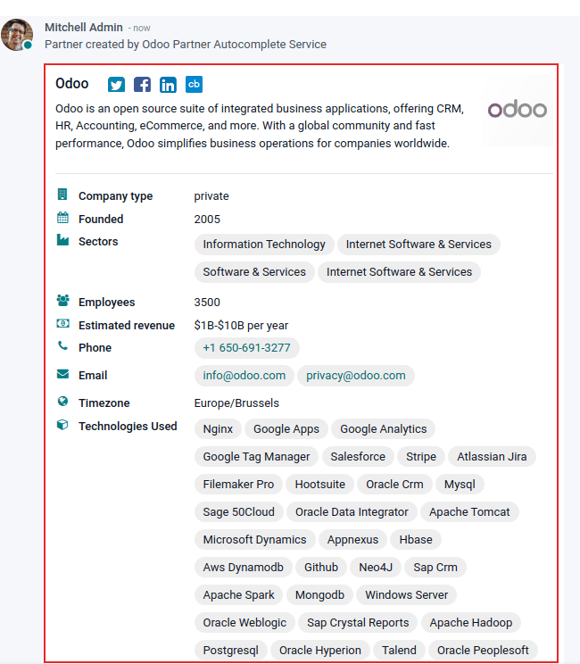

==============================================
Enrich contacts base with partner autocomplete
==============================================

*Partner autocomplete* helps to enrich the contacts database with corporate data. Select one of the
companies suggested in the drop-down menu, and quickly get all the information.

The information provided by partner autocomplete can include general information about the business
(including full business name and logo), social media accounts, :guilabel:`Company type`,
:guilabel:`Founded` information, :guilabel:`Sectors` information, the number of
:guilabel:`Employees`, :guilabel:`Estimated revenue`, :guilabel:`Phone` number,
:guilabel:`Timezone`, and :guilabel:`Technologies Used`.

.. important::
   When getting a company's contact information make sure to be aware of the latest EU regulation,
   get more information about General Data Protection Regulation on `Odoo GDPR
   <http://odoo.com/gdpr>`__. In Odoo, individual contact information cannot be searched for, using
   the partner autocomplete feature.

Configuration
=============

Go to :menuselection:`Settings --> Contacts` and activate the *Partner Autocomplete* feature.

.. image:: partner_autocomplete/settings-partner-autocomplete.png
   :align: center
   :alt: View of settings page and the activations of the feature in Odoo

Enrich contacts with corporate data
===================================

From any module, once a new company contact is entered and the user is typing the name of it, the
system will suggest a potential match. If it is selected, the contact will be populated with
corporate data.

For example, after typing *Odoo*, the following information will populate:

In the chatter the following information populates about the company, after clicking on the desired,
pre-populated contact:

.. tip:: Partner Autocomplete also works if a :abbr:`VAT (value-added tax)` number is entered
   instead of a company name.

Pricing
=======

*Partner Autocomplete* is an *In-App Purchase (IAP)* service, which requires prepaid credits to be
used. Each request consumes one credit.

To buy credits, go to :menuselection:`Settings --> Contacts --> Partner Autocomplete or Odoo IAP
--> View My Services` and select a package.

.. note::
   - If the database runs out of credits, the only information that will be populated when clicking
     on the suggested company will be the website link and the logo.

   - Learn about our *Privacy Policy* `here <https://iap.odoo.com/privacy#header_2>`_.

.. note::
   Enterprise Odoo users with a valid subscription get free credits to test :abbr:`IAP (In-App
   Purchase)` features before deciding to purchase more credits for the database. This includes
   demo/training databases, educational databases, and one-app-free databases.

.. seealso::
   :doc:`../../../essentials/in_app_purchase`
